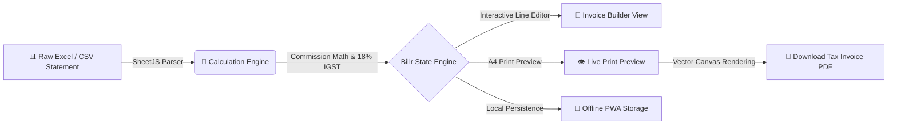

<div align="center">

  

  # Billr
  ### Modern GST Commission & Tax Invoice Automation Engine

  <p align="center">
    <b>High-precision GST tax invoice and commercial commission billing system with smart Excel statement ingestion, dual-rate calculation engines, auto-computed IGST, and vector PDF generation.</b>
  </p>

  <p align="center">
    <a href="https://sem1colon.github.io/Billr/">
      
    </a>
    <a href="https://github.com/sem1colon/Billr/actions">
      
    </a>
    <a href="./LICENSE">
      
    </a>
  </p>

  <p align="center">
    
    
    
    
    
    
  </p>

</div>

---

## 🌟 Overview

**Billr** is a production-grade, compliance-ready web application engineered for commission agents, chemical distributors, brokers, and multi-state suppliers. It eliminates manual spreadsheet accounting by automatically parsing raw monthly sales statements (`.xlsx`, `.xls`, `.csv`), computing per-unit and percentage commissions, applying statutory Indian GST rules (IGST / CGST / SGST), and generating pixel-perfect, print-ready vector A4 Tax Invoices.

Pre-configured with real-world reference data for **Murthy Chemical Agencies** (Seller, Telangana GSTIN `36ABXFM3174B1Z1`) billing to **Praj Industries Limited** (Buyer, Maharashtra GSTIN `27AAACP6090Q1ZS`), Billr is fully customizable for any multi-tier commercial enterprise.

---

## ⚡ Architecture & Workflow



---

## 🚀 Key Features

### 1. 📊 Smart Spreadsheet Statement Parser
- **Drag-and-Drop Ingestion**: Parse complex multi-column workbooks (`.xlsx`, `.xls`, `.csv`) in milliseconds using SheetJS.
- **Intelligent Header Mapping**: Automatically detects client names, invoice numbers, dispatch dates, product descriptions, quantities, unit prices, and commission rates.
- **Multi-Party Filtering**: Filter rows by client/consignee (e.g., *Bio Agro Energy*, *Ravindra & Co*, *SNJ Sugars*, *Andhra Sugars*, *Vishwa Samudra*) to generate tailored individual or consolidated invoices.

### 2. 🧮 Indian GST Calculation Engine
- **Dual Commission Modes**: Calculate commissions either as a **fixed rate per unit** (e.g., `₹16.50 / kg`) or as a **percentage of sales turnover**.
- **Turnover Derivation**: Automatically calculates gross supply turnover alongside agent commission.
- **Statutory Tax Calculations**: Auto-computes 18% Integrated GST (IGST) or CGST+SGST with Indian numbering formatting (Lakhs & Crores) and instant currency-to-words translation.

### 3. 📄 Vector PDF & Print Engine
- **A4 Portrait Layout**: Formatted according to statutory Indian GST Tax Invoice legal guidelines.
- **Interactive Live Preview**: Zoomable, responsive A4 document canvas with instant recalculation.
- **Digital Signatures**: Draw, upload, or pre-fill partner authorization signatures directly onto invoices.
- **Bank & Remittance Details**: Embeds NEFT/RTGS bank details, IFSC codes, PAN, and GSTIN automatically.

### 4. 📱 Next-Gen Progressive Web App (PWA)
- **iPhone 16 & iOS Safari Optimized**: High-resolution Apple touch icons, standalone full-screen display, and safe-area padding.
- **Native iOS Install Guide**: Interactive bottom sheet guiding iPhone users through Safari's "Add to Home Screen" flow.
- **Offline Reliability**: Service worker caching allows offline invoice generation in remote industrial areas.

### 5. 💎 Clean & Modern User Experience
- **Uncluttered Navigation**: Streamlined top bar with responsive tab navigation and a unified options menu.
- **Accessibility Mode**: High-contrast, large-text mode designed for senior accountants and warehouse staff.

---

## 🛠️ Tech Stack

| Layer | Technology | Purpose |
| :--- | :--- | :--- |
| **Frontend Framework** | [React 19](https://react.dev/) + [TypeScript](https://www.typescriptlang.org/) | Type-safe reactive UI components |
| **Build & Tooling** | [Vite 6](https://vitejs.dev/) | Lightning-fast HMR and optimized production bundling |
| **Styling & Design** | [Tailwind CSS v4](https://tailwindcss.com/) | Modern utility-first styling with custom glassmorphism |
| **PDF Generation** | [jsPDF](https://github.com/parallax/jsPDF) + [AutoTable](https://github.com/simonbengtsson/jsPDF-AutoTable) | Client-side vector PDF document generation |
| **Spreadsheet Engine** | [SheetJS (xlsx)](https://sheetjs.com/) | Excel (`.xlsx`, `.xls`) and CSV ingestion |
| **Animations & Icons** | [Motion](https://motion.dev/) + [Lucide React](https://lucide.dev/) | Fluid micro-interactions and iconography |
| **Deployment** | [GitHub Actions](https://github.com/features/actions) + [GitHub Pages](https://pages.github.com/) | Automated CI/CD deployment pipeline |

---

## 🏁 Getting Started

### Prerequisites
- **Node.js**: `v18.0.0` or higher (Node 20+ recommended)
- **Package Manager**: `npm`, `pnpm`, `yarn`, or `bun`

### Installation

1. **Clone the repository:**
   ```bash
   git clone https://github.com/sem1colon/Billr.git
   cd Billr
   ```

2. **Install dependencies:**
   ```bash
   npm install
   ```

3. **Start the development server:**
   ```bash
   npm run dev
   ```
   Open [http://localhost:3000](http://localhost:3000) in your browser.

4. **Build for production:**
   ```bash
   npm run build
   ```

5. **Preview production build locally:**
   ```bash
   npm run preview
   ```

---

## 📜 Available Scripts

| Command | Description |
| :--- | :--- |
| `npm run dev` | Starts local development server at port 3000 |
| `npm run build` | Builds optimized production bundle to `/dist` |
| `npm run preview` | Serves the production build locally for verification |
| `npm run lint` | Runs TypeScript type checking (`tsc --noEmit`) |
| `npm run deploy` | Deploys `/dist` directly to the `gh-pages` branch |
| `npm run clean` | Cleans previous build artifacts |

---

## 📂 Project Structure

```
Billr/
├── .github/
│   └── workflows/
│       └── deploy.yml          # GitHub Actions automated deploy to Pages
├── public/
│   ├── apple-touch-icon.png    # 180x180 high-res icon for iOS Safari
│   ├── favicon-32x32.png       # 32x32 browser tab icon
│   ├── icon-192.png            # 192x192 PWA launcher icon
│   ├── icon-512.png            # 512x512 maskable splash icon
│   ├── icon.svg                # Master vector brand mark
│   ├── manifest.json           # PWA web app manifest
│   └── sw.js                   # Service Worker cache controller
├── scripts/
│   └── generate-icons.js       # Script to generate raster PWA icons from SVG
├── src/
│   ├── components/
│   │   ├── BillrLogo.tsx       # Modern geometric brand logo
│   │   ├── BottomDockNav.tsx   # Mobile & tablet step navigation dock
│   │   ├── BusinessSettingsView.tsx # Seller & Buyer agency profile manager
│   │   ├── DeveloperCredit.tsx # Attribution footer
│   │   ├── ExcelImportView.tsx # Statement spreadsheet parser view
│   │   ├── HeaderNav.tsx       # Clean top navigation bar with options menu
│   │   ├── InvoiceBuilderView.tsx # Primary invoice line-item editor
│   │   ├── InvoiceLivePreview.tsx # Live A4 print preview with PDF export
│   │   ├── IosInstallModal.tsx # Native iPhone / iOS Safari PWA install guide
│   │   ├── ItemFormModal.tsx   # Add/Edit invoice item modal
│   │   └── SignatureModal.tsx  # Draw & upload partner signature modal
│   ├── data/
│   │   └── sampleData.ts       # MCA vs Praj reference invoice dataset
│   ├── types.ts                # TypeScript domain models & interfaces
│   ├── utils/
│   │   ├── excelParser.ts      # SheetJS statement processor & exporter
│   │   ├── numberToWords.ts    # Indian numbering system currency converter
│   │   ├── pdfGenerator.ts     # jsPDF GST invoice document generator
│   │   └── signatureUtils.ts   # Canvas signature encoders
│   ├── App.tsx                 # Root application controller
│   ├── index.css               # Tailwind CSS v4 design tokens & fonts
│   ├── main.tsx                # React DOM entry point
│   ├── serviceWorkerRegistration.ts # PWA lifecycle hooks
│   └── vite-env.d.ts           # Vite client type definitions
├── LICENSE                     # Commercial & Non-Commercial License Agreement
├── package.json                # Project dependencies & metadata
├── tsconfig.json               # TypeScript compiler configuration
└── vite.config.ts              # Vite bundler configuration
```

---

## 📜 License & Terms of Use

This project is licensed under the **Commercial & Non-Commercial Use License Agreement** (PolyForm Noncommercial 1.0.0 framework with Commercial Terms).

- **Personal / Educational / Evaluation Use**: Free to inspect, study, test, and run for non-commercial purposes.
- **Commercial Use / Production Billing Deployment**: Any commercial invoicing, client billing, resale, proprietary modification, or SaaS deployment requires a paid Commercial License Agreement directly from the copyright holder.

For commercial licensing inquiries, contact:
- **Author**: Vamsi Kaza (sem1Colon Inc.)
- **Website**: [https://sem1colon.github.io](https://sem1colon.github.io)
- **Email**: [vamsi.kaza007@gmail.com](mailto:vamsi.kaza007@gmail.com)

---

<div align="center">
  <sub>Crafted with precision by <a href="https://sem1colon.github.io"><b>sem1Colon Inc.</b></a></sub>
</div>
